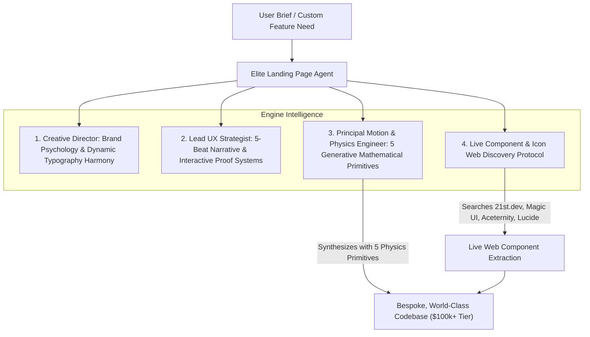

# 🧠 Master Design Engineering Intelligence & Generative Physics Engine
> **Autonomous $100k+ Tier Design Engineering Team & Live Component Discovery System**
> *Synthesized from top design engineering ecosystems: Magic UI, Aceternity UI, HeroUI, shadcn/ui, Transitions.dev, Skipper UI, Kibo UI, ReUI, Tailorarch, 21st.dev, and Lucide.*

---

## 🏛️ 1. The Autonomous 3-Role Design Engineering Model

We reject static templates and fixed component limits. Every landing page is engineered by a virtual collaborative agency team consisting of 3 cognitive roles:



---

## 🔍 2. Live Component, Effect & Icon Web Discovery Protocol

When a user requests a custom animation, unique component, specialized visual chart, or niche icon layout:
* **The Agent triggers Live Web Discovery:**
  1. Queries modern component registries and design engineering showcases (`21st.dev`, `magicui.design`, `ui.aceternity.com`, `lucide.dev`, `shadcn/ui`, `kibo-ui.com`, `reui.dev`, `skiper-ui.com`).
  2. Extracts the clean, dependency-light React + Tailwind + Motion code snippet.
  3. Adapts the component to the project's design tokens and active typography trio.
  4. Automatically integrates the new pattern into the local knowledge base.

---

## 🔬 3. The 5 Generative Mathematical Physics Primitives

Instead of being confined to fixed components, the engine uses **5 fundamental mathematical physics formulas** to synthesize *any* custom visual effect on demand:

### 1️⃣ Primitive A: Reactive Raycasting (Mouse Coordinates & Spotlights)
* **Mathematical Formula:** Mouse position offset translated to normalized CSS variables:
  ```tsx
  const handleMouseMove = (e: React.MouseEvent<HTMLDivElement>) => {
    const rect = e.currentTarget.getBoundingClientRect();
    const x = e.clientX - rect.left;
    const y = e.clientY - rect.top;
    e.currentTarget.style.setProperty('--mouse-x', `${x}px`);
    e.currentTarget.style.setProperty('--mouse-y', `${y}px`);
  };
  ```
* **Applications:** Dynamic card spotlight masks (`radial-gradient(circle 350px at var(--mouse-x) var(--mouse-y), rgba(99,102,241,0.15), transparent)`), reactive button border glares, magnetic button pull physics.

### 2️⃣ Primitive B: 3D Perspective Geometry & Specular Glare
* **Mathematical Formula:** 3D parallax matrix calculation:
  ```tsx
  const rotateX = ((y - centerY) / centerY) * -12; // deg
  const rotateY = ((x - centerX) / centerX) * 12; // deg
  // Applied to: transform: perspective(1000px) rotateX(${rotateX}deg) rotateY(${rotateY}deg) scale3d(1.02, 1.02, 1.02);
  ```
* **Applications:** 3D Card tilt, interactive product snapshot visualizers, spatial depth layers.

### 3️⃣ Primitive C: Spring Interpolation & Kinetic Data Streams
* **Mathematical Formula:** Smooth RequestAnimationFrame (RAF) interpolation:
  ```tsx
  // currentValue += (targetValue - currentValue) * 0.08 (Spring Damping)
  ```
* **Applications:** Rolling number counters (`NumberTicker`), live latency badges (`12ms`), auto-flowing activity streams (Magic UI `AnimatedList`).

### 4️⃣ Primitive D: Dual-Mask Plasma Optics (Spectrum Border Light)
* **Mathematical Formula:** Pure CSS mask compositing:
  ```css
  -webkit-mask: linear-gradient(#fff 0 0) content-box, linear-gradient(#fff 0 0);
  -webkit-mask-composite: xor;
          mask-composite: exclude;
  ```
* **Applications:** Multi-color liquid plasma borders, high-velocity neon beam traces (`BorderBeam`), shimmering metallic card highlights.

### 5️⃣ Primitive E: Canvas Particle & Ambient Mesh Shaders
* **Mathematical Formula:** Vector particle physics & trigonometric wave functions (`sin(x * freq + time) * amp`):
* **Applications:** Retro perspective grids, interactive mouse-repelling dust particles, organic sweeping aurora waves, laser grid traces.

---

## 🎨 4. Dynamic Typography Harmony Matrix

Every landing page receives a custom-paired **Typography Trio** from 6 distinct aesthetic families:

| Aesthetic Family | Display / Headline Font | UI & Body Font | Meta / Data Font | Best Suited For |
| :--- | :--- | :--- | :--- | :--- |
| **1. Editorial Luxury & Intellect** | `Instrument Serif` / `Playfair Display` | `Inter` / `Geist Sans` | `JetBrains Mono` (tnum) | High-Finance, AI Studios, Elite SaaS |
| **2. Futuristic Studio & High-End AI** | `Syne` / `Clash Display` | `Plus Jakarta Sans` | `Space Mono` | Generative AI, Creative Tech, Web3 |
| **3. Warm Modernist & Human SaaS** | `Fraunces` / `Cinzel` | `Satoshi` / `General Sans` | `Fira Code` | Modern Workflows, Analytics, Creator Tools |
| **4. High-Speed Cyber & DevTools** | `Cabinet Grotesk` / `Outfit` | `Geist Sans` | `IBM Plex Mono` | Cloud Infra, Terminal Tools, APIs |
| **5. Spatial Minimalism (Apple Vibe)** | `Outfit` (Bold / Semi) | `Inter` | `DM Mono` | Consumer Tech, Spatial Computing, Health |
| **6. Elite Arabic RTL Harmony** | `Cairo` (Bold) / `Amiri` | `IBM Plex Sans Arabic` | `Tajawal` / `Fira Code` | Modern Arabic SaaS & Global RTL Markets |

---

## 📚 5. Deep Multi-Library Component Matrix (100+ Primitives)

| Ecosystem | Signature Capabilities |
| :--- | :--- |
| **Magic UI** | Retro Grid, Warp Background, Flickering Grid, Animated List, Border Beam, Shine Border, Shiny Text, Interactive Globe, Icon Cloud, Number Ticker, Meteors, Rainbow Button. |
| **Aceternity UI** | Lamp Section Header, Aurora Background, Background Beams, 3D Pin, 3D Tilt Card, Sparkles, Tracing Beam on Scroll, Text Generate Effect, Infinite Moving Cards. |
| **HeroUI** | Fluid Glass Cards, Sliding Segmented Pill Controls, Spring Modals & Drawers, Accessible Primitives. |
| **Transitions.dev** | Number Ticker, Morphing Badges, Spring Card Resizers, Shimmer Sweeps, Layout Expansions. |
| **Skipper UI** | Micro-Glow Rings, Elevated Obsidian Surfaces, Concentric Status Pulse Rings. |
| **Kibo UI** | Interactive Kanban & Workflow Boards, Telemetry Data Grids with Sparklines, QR Primitives. |
| **ReUI** | High-Converting Auth Modals, Interactive Annual/Monthly Billing Matrix with Savings Pill. |
| **Tailorarch** | Layered Perspective Architecture Diagrams, Generative Spatial Technology Visualizers. |
| **Lucide Icons** | Pixel-perfect vector icon system with smooth SVG hover transformations. |
