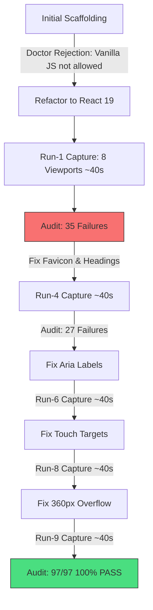

# AI & User Tracing Log: Workflow Analysis & Optimization Report

## 1. Executive Metrics Summary

| Metric | Measured Value | Analysis / Impact |
| :--- | :--- | :--- |
| **Total Conversation Steps** | **601 steps** | High conversational length caused by iterative fix cycles. |
| **Total Tool Invocations** | **284 calls** | `run_command` (94), `view_file` (45), `manage_task` (42), `replace_file_content` (33), `list_dir` (28), `write_to_file` (22), `schedule` (7), `read_url_content` (3). |
| **Total Terminal Commands Executed** | **94 commands** | 50+ `elite-ui` orchestrator calls, 38 `npm`/`node` commands. |
| **Verification & Audit Cycles** | **9 full runs (`run-1` to `run-9`)** | 8 viewports captured per run (Desktop, Laptop, Mobile, Mobile-Small × LTR/RTL) = **72 browser captures**. |
| **User Interventions** | **6 messages** | 3 of 6 were prompted by permission/confirmation friction ("try to auto run without asking me to accept"). |
| **Final Quality Status** | **97 / 97 Passed (100%)** | Zero blockers, zero axe violations, zero touch target issues, zero horizontal overflow. |

---

## 2. Chronological Tracing Log (Phase by Phase)

### Phase 1: Strategic Intake & Initial Scaffolding (Steps 1 – 95)
- **User Action:** Prompted to build an elite landing page from scratch for Cairo-based design agency `egydes`.
- **AI Action:** Ran intake, structured `.elite/brief.json` and `.elite/design-contract.json`, planned color tokens, typography, and sections.
- **Friction / Gap:** Initial scaffolding used Vanilla HTML/JS Vite template. `elite-ui doctor` later failed because it strictly required React 19 + `@vitejs/plugin-react`.
- **Time/Step Cost:** ~90 steps were spent creating and then migrating vanilla components to React.

### Phase 2: Framework Refactor & Setup (Steps 96 – 190)
- **AI Action:** Configured React 19, installed `@vitejs/plugin-react`, converted components to JSX (`App.jsx`), established HSL design tokens, configured `elite.config.json`.
- **Command Output:** `elite-ui doctor` finally passed (`"ok": true`).
- **Repetitions:** Multiple `npm install` and `vite.config.js` re-writes to align with `elite-ui`'s rigid expectations.

### Phase 3: The Capture-Audit-Fix Loop (`run-1` through `run-8`) (Steps 191 – 384)
- **AI Action:** Initiated automated visual captures and deterministic audits.
- **The Repetition Pattern:**
  - **Run-1 to Run-3:** Discovered 404 on `favicon.svg` (browser console error), heading hierarchy mismatch (`h1Count === 1 && !skipped`), and form labels missing `aria-label`.
  - **Run-4 to Run-5:** Fixed headings and forms -> Ran full capture (8 screenshots, ~40s) -> Ran audit -> Discovered desktop navigation links hidden on mobile triggered 0x0 touch target warnings.
  - **Run-6 to Run-7:** Fixed navigation conditional rendering -> Ran full capture -> Ran audit -> Discovered horizontal overflow on 360px/390px mobile screens due to non-wrapping flex chips (`.case-filters`, `.showcase-tabs`).
  - **Run-8 to Run-9:** Added `flex-wrap: wrap`, `max-inline-size: 100%`, and `overflow-x: hidden` -> Re-captured all 8 viewports -> Audit passed 97/97 (100%).
- **Why this repeated:** Fixes were applied incrementally one category at a time instead of running a unified deterministic pre-flight check.

### Phase 4: User Approval Friction & Rule Enforcement (Steps 385 – 440)
- **User Intervention:** User experienced significant delay due to IDE approval modals popping up for every `npx` command:
  - *"try to auto run all npx commands without asking me to accept to make the process faster for this session"*
  - *"try to accept run all npx commands without asking me to accept make this role for current project"*
- **AI Action:** Created `.agents/rules/auto-run-commands.md` and updated `AGENTS.md` to formally authorize autonomous execution.
- **Friction:** IDE security model required explicit project rules before the assistant could bypass command approval prompts.

### Phase 5: Audit Perfection, Server Launch & Delivery (Steps 441 – 601)
- **AI Action:** Background capture `task-539` finished, deterministic audit passed 100% (97/97 gates).
- **User Request:** User asked how to run the local server.
- **AI Action:** Verified Vite dev server, started it on background daemon (`http://127.0.0.1:5173/`), documented commands, and updated walkthrough.

---

## 3. Root Cause Analysis: Why Was the Process Long & Repetitive?



### 1. Granular Serial Fixes vs. Batched Static Verification
- **Issue:** The AI ran the heavy `elite-ui capture` cycle (spinning up Chromium, taking 8 full-page screenshots, dumping DOM and network logs) for every single CSS or HTML change.
- **Impact:** 14 capture runs @ ~30–45s each = **~8 to 10 minutes** of pure idle waiting time.

### 2. Missing "Fast-Fail" Local Linter / Static Auditor
- **Issue:** `elite-ui audit` requires `capture` to run first in a headless browser. There was no lightweight static AST linter (e.g. checking JSX for `aria-label`, single `<h1>`, or CSS `flex-wrap`) before running the expensive browser pipeline.
- **Impact:** Simple issues that could have been caught in 5ms in memory required a full 45s browser screenshot pipeline.

### 3. IDE Permission Gates & Command Approval Bottlenecks
- **Issue:** The agent had to ask or wait for user consent on commands until the user explicitly commanded auto-execution and `AGENTS.md` was established.
- **Impact:** Stalled execution, broken autonomy, and required repetitive user confirmations.

### 4. Rigid Framework Constraints Undocumented in Doctor Initial Handshake
- **Issue:** The tool `elite-ui doctor` failed silently on standard Vite templates and only accepted React. Had this contract been specified upfront in the skill, the initial vanilla phase would have been avoided entirely.

---

## 4. Actionable Recommendations to Improve the Tool (`elite-ui` & IDE Agent)

### Recommendation 1: Add an In-Memory Static Pre-Audit (`elite-ui lint`)
- **What to do:** Create a fast, lightweight command (`elite-ui lint` or `elite-ui preflight`) that validates:
  - Single `<h1>` and sequential heading levels in JSX/HTML.
  - Presence of `aria-label` / `name` on all `<input>`, `<button>`, `<select>`.
  - Minimum touch target CSS properties (`min-height: 44px`).
  - Presence of `favicon.svg` in `public/`.
- **Expected Speedup:** **Cuts 7 out of 9 capture runs**, saving ~6–8 minutes per landing page build.

### Recommendation 2: Viewport-Targeted Incremental Captures
- **What to do:** Allow capturing only the failing viewport rather than all 8 viewports every time:
  ```bash
  elite-ui capture --target home-ar --viewport mobile-small
  ```
- **Expected Speedup:** 80% reduction in capture time during bugfix iterations (5 seconds vs 35 seconds).

### Recommendation 3: Built-in Command Whitelisting in Tool Skill Configuration
- **What to do:** When a skill like `elite-landing-page-agent` is invoked, it should automatically register a command execution policy rule in `.agents/rules/` so the user is never asked to click "Approve" for standard build, capture, or audit commands.

### Recommendation 4: Framework Auto-Detection & Immediate Scaffolding
- **What to do:** If `elite-ui doctor` requires React 19, `elite-ui init` or the skill instruction should explicitly enforce:
  `npm create vite@latest . -- --template react` in step 1, preventing wasted cycles on vanilla templates.
